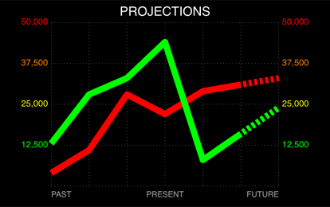
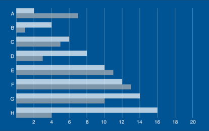

#  Graffeine-Demo

iOS app demonstrating how to quickly put together bar and line graphs using *[graffeine](https://github.com/quickthyme/graffeine)*.

Here are a few lo-res examples:

 
  

 
  

 
  

