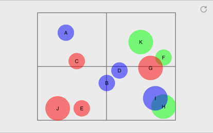

#  Graffeine-Demo

iOS app demonstrating how to quickly put together charts and graphs using *[graffeine](https://github.com/quickthyme/graffeine)*.

Here are a few lo-res examples:

**Descending Vertical Bars** demonstrates how to compose a basic bar graph.

Select a bar by tapping on it. Tapping anywhere else on the graph will cycle
between the data sets, using animation.
 
 

**Red Green Lines** demonstrates how to compose a basic double line graph.
In this scenario, we're presenting one red and one green line, with added
projections.

Tapping anywhere on the graph will reload the data with animation.

 

**Horizontal Grouped Bars** demonstrates how to compose a horizontal bar graph with
grouping. Bar layer's subdivision is used here.

Tapping anywhere on the graph will cycle through the data sets and reload
using animation.

 

**Line Points and Smoothing** demonstrates adding line smoothing and data points
to a line graph.

Tapping anywhere on the graph will animate cycling through the data sets.

 

**Scatter Plot** is demonstrating some circles.

 

**Pie Slices** demonstrates a pie/donut chart.

Tapping on a slice will select it. Tapping anywhere else will reload, cycling
through the data sets, and randomly switching between different animations.

 

**Candlestick** demonstrates how to compose a candlestick graph by mapping
randomly-generated, artificial "trading" data.

Tapping a candlestick selects it; tapping anywhere else reloads new random data.
 
  
