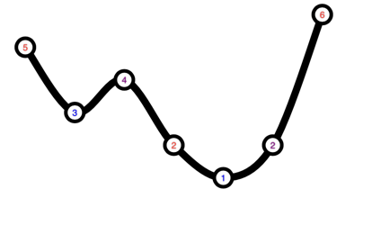
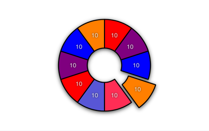

#  Graffeine-Demo


[](https://travis-ci.com/quickthyme/graffeine-demo)


iOS app demonstrating how to quickly put together charts and graphs using *[graffeine](https://github.com/quickthyme/graffeine)*.


## Getting Started

This application has a dependency on [graffeine](https://github.com/quickthyme/graffeine), which has been imported as a **git submodule**.
Whenever you clone or update from the source repository, don't forget to also update the submodule using:

```
git submodule update --init
```


## Demo

The demos are divided up into three sections, bars, lines, and circles.


### Bars


#### Descending Vertical Bars


Interactive vertical bar graph.
 
<br />


#### Horizontal Grouped Bars


Horizontally displayed bar graph with grouping.

<br />


#### Too Low For Zero


Bar graph displaying negative values.
 
<br />


#### Candlestick


Randomly-generated, interactive candlestick chart.
Single-axis scrolling and resizing.
 
<br />


#### Progress Indicators


How to make quick and easy custom progress indicators.
 
<br />


### Lines


#### Line Points and Smoothing



Demonstrates how to add smoothing (curvature) and data points to a line graph.

<br />


#### Area Fill


Multi-line graph with area fill.
 
<br />


#### Red Green Lines


Basic double line graph.

<br />


### Circles


#### Pie Slices



Interactive pie and donut charts.
Includes examples for adding animation and zooming effects.

<br />


#### Scatter Plot


Bubble chart example.

<br />

